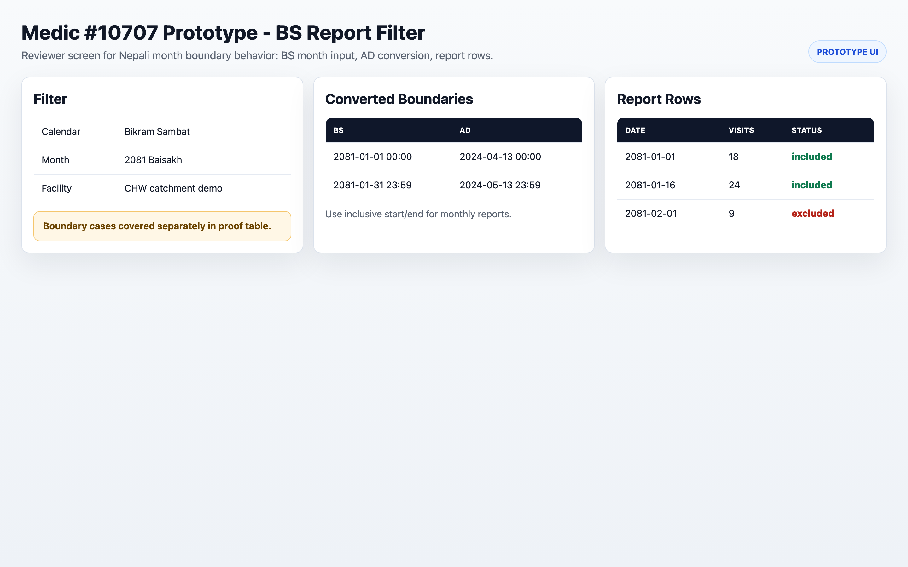
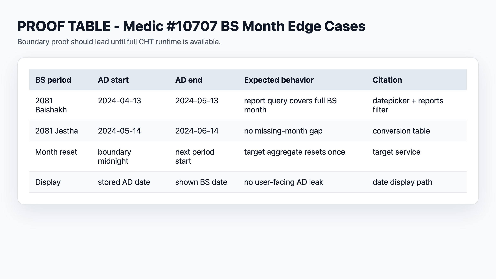
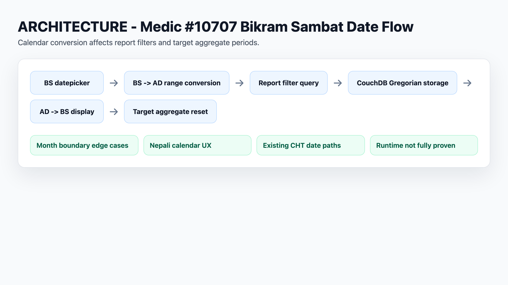

# Medic #10707 Proof Packet

Date: 2026-05-05

## Status

Proposal-facing proof for Bikram Sambat enhancement. Proves issue understanding and edge-case mapping.

## Issue
- https://github.com/medic/cht-core/issues/10707
- Label: DMP 2026

## Proof Artifacts

| Artifact | Claim | Status |
|----------|-------|--------|
| `README.md` | Source audit | ✅ |
| `bs-ad-conversion-table.md` | BS→AD edge cases | ✅ NEW |
| `report-filter-mock.md` | Reports filter UI/query behavior mock | ✅ NEW |

## Source Citations

| File | Usage | Status |
|------|-------|--------|
| `webapp/src/js/enketo/widgets/bikram-sambat-datepicker.js` | BS datepicker widget | ✅ Cited |
| `webapp/src/ts/modules/reports/reports-sidebar-filter.component.ts` | Reports filter | ✅ Cited |
| `webapp/src/ts/services/date.service.ts` | Date service | ✅ Cited |
| `webapp/src/ts/modules/target-aggregates/target-aggregates.service.ts` | Target service | ✅ Cited |

## What's Proven

- Issue exists and is valid on GitHub
- Source files identified with citations
- BS→AD conversion edge cases documented
- Report filter boundary scenarios mapped
- Report-filter mock documents expected UI and AD query behavior
- Acceptance tests defined

## What's NOT Proven

- No local build (ng not found)
- No running app
- No fix implemented

## Proof Boundary

This is **proposal-facing proof** - source citation and edge-case mapping, not implementation.

---

## Active Issue: #10707 ONLY

BS date handling enhancement in CHT (Community Health Toolkit).

<!-- C4GT_VISUAL_SCREENSHOTS_START -->
## Visual Proof Screenshots

Generated reviewer-facing PNGs. Runtime/prototype screenshots lead each project; architecture and proof tables remain supporting evidence. Prototype images do not expand the verified implementation boundary.

### Prototype UI: BS month filter -> AD boundaries -> report rows.

Path: `screenshots/prototype-bs-report-filter.png`

### BS edge-case table; boundary proof leads.

Path: `screenshots/bs-edge-case-table.png`

### Bikram Sambat date flow across filters/storage/display.

Path: `screenshots/bs-date-flow.png`
<!-- C4GT_VISUAL_SCREENSHOTS_END -->
